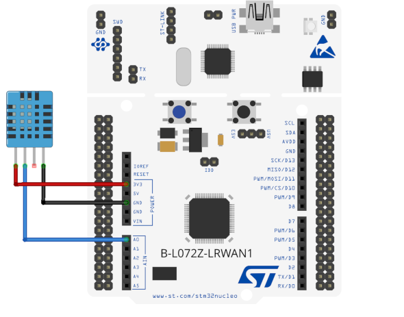
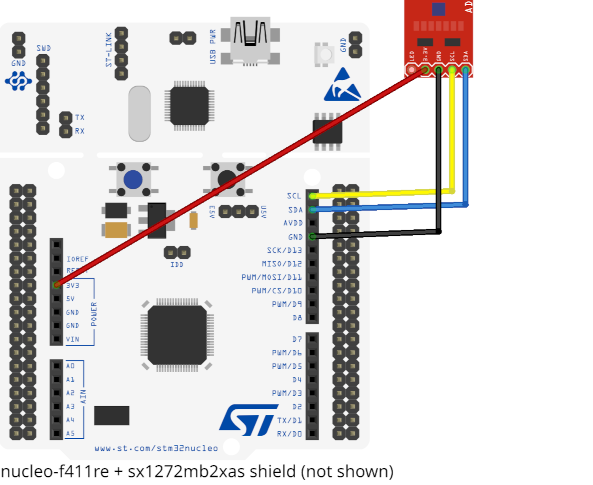
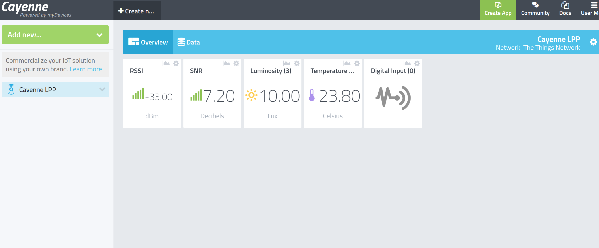

GNRC LoRaWAN SAUL application
=============================

This application demonstrates a LoRaWAN application along with SAUL. The
application makes use of RIOT's own native LoRaWAN stack called GNRC LoRaWAN and
a generic actuator/sensor abstraction layer in RIOT called SAUL.

The application has been tested to work with the following hardware setup 

1. `demo_bl072z` : B-L072Z-LRWAN1 + DHT11 sensor.
2. `demo_nucleo` : nucleo-f411re + sx1272mb2xas shield + tsl45315 sensor

Usage
=====

1. Wire the sensor(s). Shown below is `demo_bl072z`: B-L072Z-LRWAN1 + DHT11 sensor.
    

    Shown below is `demo_nucleo` : nucleo-f411re + sx1272mb2xas shield + tsl45315 sensor.
    
    


2. Configure the default compile time configurations, which includes OTAA credentials ( System ---> Networking ---> Configure LoRaWAN MAC). Configurations can be accessed by running :
```
make menuconfig
```


3. Compile and flash the application.
```
make BOARD=demo_nucleo all flash

```
4. Access the terminal of the board.

```
make term
```
5. The device should now display logs in terminal.


6. The uplinks sent by the node should now be visible in Network Server.

7. The application encodes the payload in [Cayenne LPP data format](https://github.com/myDevicesIoT/CayenneLPP) which makes it easy to connect Application Server to a Cayenne Dashboard.
LoRaWAN services like The Things Network offers native integration which makes it a straight forward process.



Key takeaways
=============

### Sensor Actuator Uber Layer 
SAUL is a generic actuator/sensor interface in RIOT. Its purpose is to enable unified interaction with a wide range of sensors and actuators through a set of defined access functions and a common data structure.
SAUL implements the SAUL registry which is used to search and access connected peripherals/sensors.
Searching through the registry, accessing and printing sensed data is shown below:
```
phydat_t res;
int pos = 0;
saul_reg_t *dev;

/* Iterate through all SAUL instances.
 * A SAUL instance has only one type and PHYDAT representation.
 * A physical device may have more than one SAUL instance */
while ((dev = saul_reg_find_nth(pos++))) {
    /* Read value from SAUL device and dump the PHYDAT */
    int dim = saul_reg_read(dev, &res);
    printf("\nDev: %s\tType: %s\n", dev->name,
            saul_class_to_str(dev->driver->type));
    }
    phydat_dump(&res, dim);
}
```
### Hardware Configuration

The board specific onboard devices are defined in `board.h`, this includes
LED's and onboard sensors if any. Many a times application can have several sensors
and its HW peripheral interface is configured in `xxxx_params.h`.


### Network interfaces

Network interfaces are essentially threads for protocols below the network layer.
A RIOT application can have more than one network interface, for eg: IEEE 802.15.4,
Ethernet, BLE. In this application, `gnrc_netif_t *_get_lorawan_netif(void)` is a
function that iterates over the available networks to find the LoRaWAN interface. 
